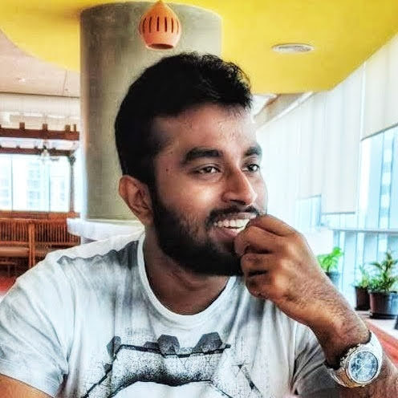

<h2> Hi! I'm Silesh Chandran 😃. </h2>
{: width="240" .right}

I'm from Kerala, India and currently working as a full stack developer at SAP Labs India. I have 3 years of work experience as a developer and am currently working with SAP Analytics cloud.

I've been passionate about programming and tech ever since I first got my hands on a computer. Tinkering with mods and learning to make video games is what fueled my interest in this field and I'm still a kid at heart exploring this wonderful world of tech.
I enjoy competitive coding in my free time, and I like to keep myself updated with the latest happenings in the tech community. I am an avid gamer and an even bigger reader. I enjoy fantasy novels, anime, manga, tv series etc.

I hope to translate some of my everyday learnings into articles here, both as a way to keep track of things for myself and as a way to give back to the community. I'll see you around.

To know more about me, check out [this](/resume/index.html)
